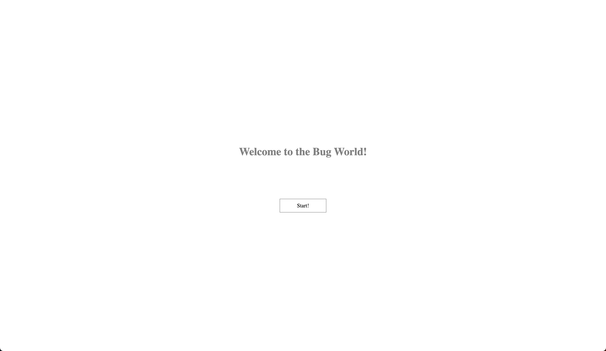
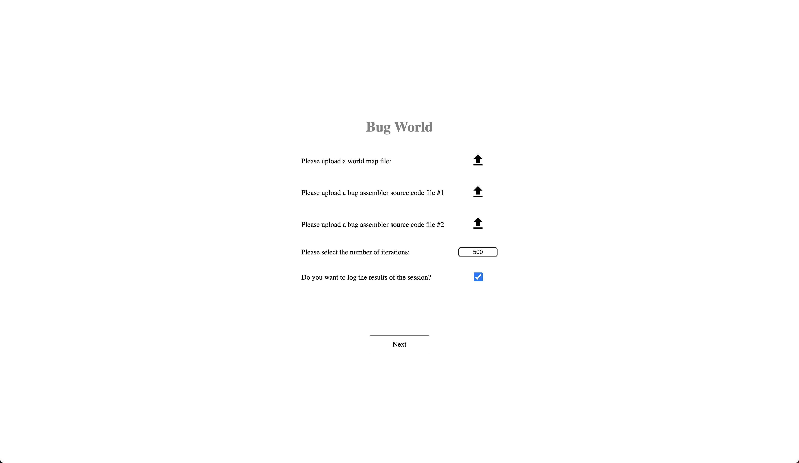
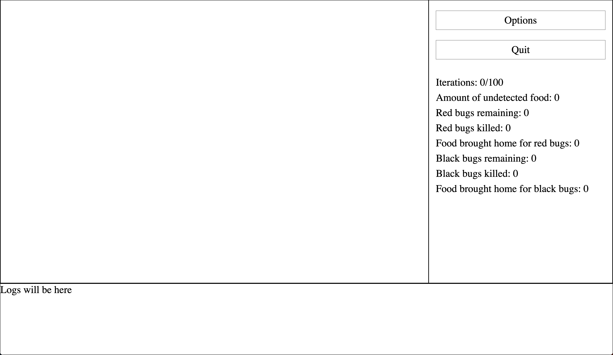
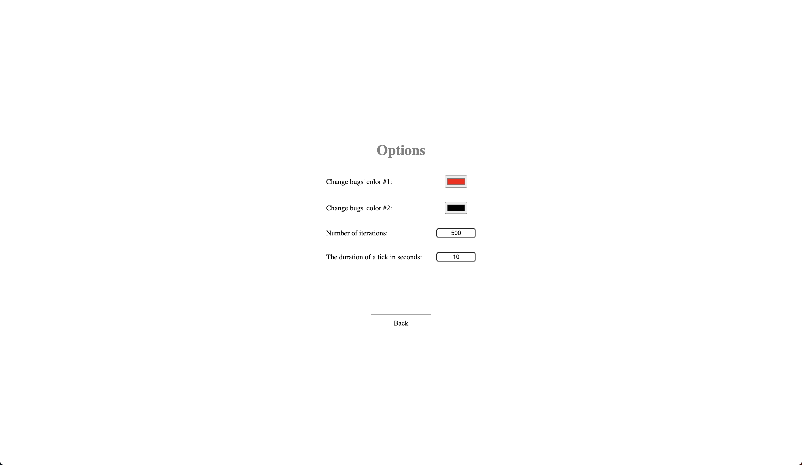

Sprint 1.

Documentation:
After launching the app, you are presented with the start page. To proceed, click "Start!"



On the next page you need to provide a world map file and source code for bugs. You can also set the number of
iterations and whether you want to log the session.



Next you are presented with a game page. It is not ready yet, so the only options you have is to click options or quit.



If you click "Options", you are presented with the settings for bugs colors. You can also change the number of
iterations and execution speed. To return to the game page, click "Back".



If you click "Quit", you first need to confirm that you really want to quit. After confirmation, you return to the start
page.


There is also a page, that can not be accessed, since the game emulation is not ready yet.
After the game ends, you are presented with an end screen. Clicking "restart" brings you back to the start screen:


Progress report:

* Created single page application (SPA) with the mocks of all pages from the specification. The inputs work, but do
  nothing. Navigation (buttons) works. SPA was chosen because it simplifies state management. This way we don't need to
  use cookies/web storage/cache api/etc, because js scripts preserve their state between pages.
* Implemented Bug Assembler according to specification. The assembler takes input from the file, reads file contents on
  the client (without sending file to the server) and parses the instructions.
* Written bug file verification. When the file is uploaded, bug assembler is executed right away. Bug assembler returns
  a set of instructions or an error, that is then passed to the user.
* Written user-documentation (see above) and documented code.
* Written tests using QUnit

Used libraries/frameworks:

* JQuery - we used it to simplify sending AJAX requests (to load pages of SPA), but we also plan to use it extensively
  when writing logic of application, since it provides an easy way to write selectors for html elements. JQuery code is
  very easy to read, so we don't expect it to cause any troubles for others. It is also easy to get rid of it, since it
  is used very sparingly.
* QUnit - used to test logic written in JS. It is also very easy to read and use.

How to deploy:

```python
live-server 
```


How to run unit tests:

Unit tests are extremely easy to run. Just navigate to the page http://localhost:port/test.html


Sprint 2.

- **Frontend:**
  - Develop the "generateWorldDoc(world)" function that creates an HTML document for the game field, featuring elements like bugs, food, barriers, and markers. 
  - Injected "generateWorldDoc" into existing structure.
  - Fixed imports and exports of functions and classes (assembler and fileupload)
  - fixed linking js files to the index html
- **Game Logic:**
  - Improved previous object structures along with function signatures.
  - Deserialization of world from file

- **Tests:**
  - Created tests for the map parsing and validation of them

